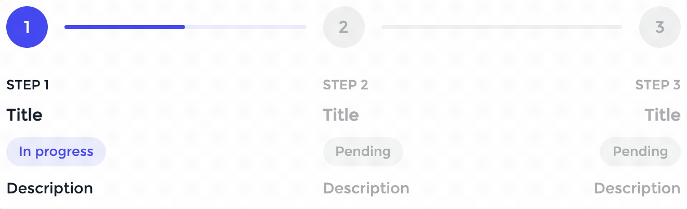

# React Progress Stepper

Minimal and beautiful stepper for React.

<p align="center">
<br/>

<br/><br/>
<a href="https://vimercati-samir.github.io/react-progress-stepper"></a>
</p>

<p align="center">
<br/>


<br/><br/>
</p>

- [Installation](#⚙️-installation)
- [Usage](#✔️-usage)
- [Modules](#🔎-modules)
  - [Stepper](#stepper)
  - [Step](#step)
  - [Content](#content)
    - [StepNumber](#stepnumber)
    - [StepTitle](#steptitle)
    - [StepStatus](#stepstatus)
    - [StepDescription](#stepdescription)
  - [useStepper](#useStepper)
- [Theming and Style Overrides](#🎨-theming-and-style-overrides)
- [License and Credits](#✏️-license-and-credits)

## ⚙️ Installation

```shell
$ npm i react-progress-stepper
$ yarn add react-progress-stepper
```

## ✔️ Usage

```js
import React from 'react';
import {
  Stepper,
  Step,
  useStepper,
} from "react-progress-stepper";

export default const App = () => {
  const { step, incrementStep, decrementStep } = useStepper(0, 3);

  return (
    <>
      <Stepper step={step}>
        <Step></Step>
        <Step></Step>
        <Step></Step>
      </Stepper>
      <button onClick={decrementStep}>Prev</button>
      <button onClick={incrementStep}>Next</button>
    </>
  )
}
```

## 🔎 Modules

### Stepper

| Property   | Type    | Description                             |
| ---------- | ------- | --------------------------------------- |
| `step`     | Integer | State to track the current step         |
| `vertical` | Boolean | Toggle vertical view                    |
| `dark`     | Boolean | Toggle dark mode                        |
| `numbered` | Boolean | Toggle if each step is numbered or not  |
| `theme`    | Object  | Customize the appearance of the stepper |

### Step

| Property        | Type     | Description                  |
| --------------- | -------- | ---------------------------- |
| `customContent` | Function | Override step circle content |

### Content

You can customize the content of each step, as the example below:

    
  
```js
import React from 'react';
import {
  Stepper,
  Step,
  useStepper,
  StepNumber,
  StepTitle,
  StepStatus,
  StepDescription,
} from "react-progress-stepper";

export default const App = () => {
const { step, incrementStep, decrementStep } = useStepper(0, 3);

return (
<>
<Stepper step={step}>
<Step>
<StepNumber />
<StepTitle>Title</StepTitle>
<StepStatus />
<StepDescription>Description</StepDescription>
</Step>
<Step>
<StepNumber />
<StepTitle>Title</StepTitle>
<StepStatus />
<StepDescription>Description</StepDescription>
</Step>
<Step>
<StepNumber />
<StepTitle>Title</StepTitle>
<StepStatus />
<StepDescription>Description</StepDescription>
</Step>
</Stepper>
</>
)
}

````

#### StepNumber

| Property | Type   | Description    |
| -------- | ------ | -------------- |
| `text`   | String | Customize text |

#### StepTitle
StepTitle comes with no property, you can easily customize it by simply putting some text inside of it.

#### StepStatus

| Property        | Type   | Description    |
| --------------- | ------ | -------------- |
| `textProgress`  | String | Customize text |
| `textCompleted` | String | Customize text |
| `textPending`   | String | Customize text |

#### StepDescription
As StepTitle, you can customize StepDescription by putting text inside of it.

### useStepper

Hook to handle the state of stepper easily, you could write your own logic to handle the state.

To work properly you need to provide two arguments to useStepper:

- **Number of current step**: starts from 0;
- **Number of steps**.

useStepper provides several utilities:

- **step**: state to track the current step;
- **incrementStep**: function to increment state by one;
- **decrementStep**: function to decrement state by one;
- **goToStep**: function to set state to a specific step number.

## 🎨 Theming and Style Overrides

You can customize the appearance of the stepper in two ways:

1. Using the theme object:

```js
{
  light: {
    step: {
      pending: {
        background: "#ededed",
        color: "#a1a3a7",
      },
      progress: {
        background: "#3c3fed",
        color: "#ffffff",
      },
      completed: {
        background: "#23c275",
        color: "#ffffff",
      },
    },
    content: {
      pending: {
        stepNumber: { color: "#a1a3a7" },
        title: { color: "#a1a3a7" },
        status: { background: "#f2f2f2", color: "#a1a3a7" },
        description: { color: "#a1a3a7" },
      },
      progress: {
        stepNumber: { color: "#131b26" },
        title: { color: "#131b26" },
        status: { background: "#e7e9fd", color: "#3c3fed" },
        description: { color: "#131b26" },
      },
      completed: {
        stepNumber: { color: "#131b26" },
        title: { color: "#131b26" },
        status: { background: "#e9faf2", color: "#23c275" },
        description: { color: "#131b26" },
      },
    },
    progressBar: {
      pending: {
        background: "#ededed",
      },
      progress: {
        background: "#e7e9fd",
        fill: "#3c3fed",
      },
      completed: {
        background: "#e9faf2",
        fill: "#23c275",
      },
    },
  },
  dark: {
    step: {
      pending: {
        background: "#1a1a1a",
        color: "#767676",
      },
      progress: {
        background: "#19b6fe",
        color: "#ffffff",
      },
      completed: {
        background: "#23c275",
        color: "#ffffff",
      },
    },
    content: {
      pending: {
        stepNumber: { color: "#767676" },
        title: { color: "#767676" },
        status: { background: "#1a1a1a", color: "#767676" },
        description: { color: "#767676" },
      },
      progress: {
        stepNumber: { color: "#ece4d9" },
        title: { color: "#ece4d9" },
        status: { background: "#08374c", color: "#19b6fe" },
        description: { color: "#ece4d9" },
      },
      completed: {
        stepNumber: { color: "#ece4d9" },
        title: { color: "#ece4d9" },
        status: { background: "#0b3a23", color: "#23c275" },
        description: { color: "#ece4d9" },
      },
    },
    progressBar: {
      pending: {
        background: "#1a1a1a",
      },
      progress: {
        background: "#08374c",
        fill: "#19b6fe",
      },
      completed: {
        background: "#0b3a23",
        fill: "#23c275",
      },
    },
  },
}
````

2. Overriding the CSS using class names, example:

```css
.step {
  width: 3em;
  height: 3em;
}

.step.progress {
  background: #6ab04c;
}
```

## ✏️ License and Credits

react-progress-stepper is released under the MIT license, feel free to use it, share and modify.

Credits and special thanks to:

- [Vishnu Prasad](https://dribbble.com/vlockn) for the cool and awesome [design inspiration](https://dribbble.com/shots/14012793/attachments/5628816?mode=media)
- [Sergio Acosta](https://codepen.io/sergio_andresac/pens/public) for the cool and awesome [check mark animation](https://codepen.io/sergio_andresac/pen/NeYbMw)
